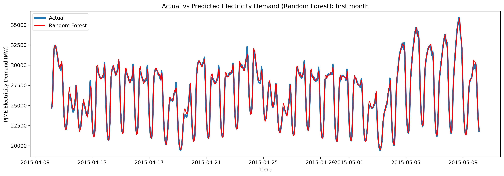
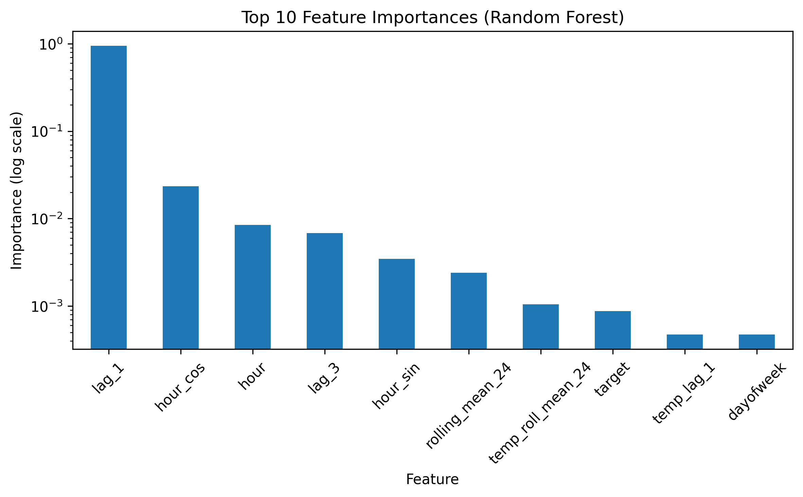

# Day-Ahead Electricity Demand Forecasting with Machine Learning and Weather Features

This project initially built a machine learning pipeline to forecast **hourly electricity demand** using historical load data. The goal was to explore how different regression models perform on a time-series forecasting problem and to identify the most informative features driving electricity demand.

## Project upgrade

This project extends a previous short-term forecasting prototype by addressing key real-world limitations:

- shifting from +1h prediction to **day-ahead (+24h) forecasting**
- incorporating **weather features (temperature)** as exogenous variables
- benchmarking machine learning models against **statistical baselines**
- introducing **robust evaluation strategies beyond standard train/test splits**

The goal is to move from a simulation setup to a more **realistic and industry-relevant forecasting pipeline**.

---

## Project overview

Electricity demand forecasting is a key problem in energy systems, supporting grid management, market operations, and demand planning.

This project implements a machine learning pipeline for **hourly electricity demand forecasting**, focusing on **day-ahead prediction (+24h horizon)** using historical load data and exogenous weather variables.

The objective is to compare statistical baselines, linear models, and ensemble methods under realistic time-series constraints.

---

## Pipeline

The project follows a structured ML workflow:

1. Load and preprocess the dataset  
2. Validate timestamps and data consistency  
3. Create calendar, cyclical, lag, and rolling features  
4. Train multiple regression models  
5. Evaluate models using multiple validation strategies, including time-series cross-validation  
6. Assess model robustness under rolling forecasting and stress testing conditions 

Pipeline overview:

Raw data  
↓  
Preprocessing  
↓  
Feature engineering  
↓  
Train/Test split  
↓  
Model training  
↓  
Evaluation  

The improved pipeline can be explored in the accompanying notebooks:

- `notebooks/02_day_ahead_forecasting.ipynb` (updated version)
- `notebooks/01_baseline_exploration.ipynb` (initial prototype)

---

## Dataset

The dataset contains **hourly electricity demand measurements**.

In the updated version of the project, weather data (temperature) is incorporated to better capture external drivers of electricity demand. Temperature data is retrieved from Open-Meteo API (hourly 2m air temperature, °C).

Main variable:

- **PJME_MW** → hourly electricity load (target variable)

The dataset is indexed by timestamp and sorted chronologically to preserve the time-series structure.

---

## Feature engineering

Several types of features are created to capture temporal patterns.

### Calendar features
- hour
- day of week
- month
- weekend indicator

### Cyclical encoding
To properly represent cyclic variables:

- hour_sin / hour_cos
- dow_sin / dow_cos

### Lag features
Past demand values used as predictors:

- lag_1 (optional, depending on configuration)  
- lag_3  
- lag_24  
- lag_168  

### Rolling statistics
Past demand variability:

- rolling_mean_24
- rolling_std_24

### Weather features
- temperature
- lagged temperature
- rolling temperature statistics (mean, variability)

All features are constructed **exclusively from past observations** to ensure strict temporal causality and prevent any form of data leakage.

---

## Models compared

The following models are evaluated:

### Baselines
- Naive forecast (previous day same hour)

### Statistical model
- **Exponential Smoothing** (Holt-Winters)

### Machine learning models
- **Ridge Regression**
- **Random Forest Regressor**
- **Gradient Boosting Regressor**

Models are trained on historical data and evaluated using multiple validation strategies.

---

## Evaluation metrics

Model performance is evaluated using:

- **RMSE** – Root Mean Squared Error
- **MAE** – Mean Absolute Error
- **R²** – Coefficient of determination

These metrics provide complementary views on prediction accuracy.

---

## Evaluation framework

Model performance is assessed using a multi-level evaluation strategy:

### Train-Test Split
Initial performance evaluation on a chronological holdout test set.

### Time Series Cross-Validation
Used to assess model stability across multiple temporal folds.  
This approach preserves chronological ordering and prevents information leakage between training and validation sets.

### Rolling Forecast Evaluation
A realistic simulation where models are repeatedly retrained over time and used to predict future values sequentially, mimicking an operational forecasting environment.

### Stress Testing
Robustness analysis under extreme and challenging conditions:

- peak demand periods  
- extreme temperature conditions  
- temporal stability across test sub-periods   

---

## Results

The evaluation shows a clear performance hierarchy across models.

- **Naive forecasting** provides a strong baseline due to high temporal autocorrelation in electricity demand.
- **Exponential Smoothing** captures trend and seasonality effectively but is limited in modeling external drivers and nonlinear patterns.
- **Machine learning models significantly outperform statistical approaches**, with ensemble methods delivering the best results.

Among all models, **Random Forest achieved the best predictive performance**, consistently outperforming both Gradient Boosting and Ridge Regression.

Key insights:
- Lag features are the most informative predictors
- Electricity demand exhibits strong short-term persistence
- Nonlinear models are required to capture complex temporal dynamics

---

## Model Performance Visualization

To complement the numerical evaluation metrics, the following visualizations provide a more intuitive understanding of model behavior and feature relevance. These plots help assess not only overall predictive accuracy but also how the model captures temporal dynamics and which signals drive the forecasts.

### Actual vs Predicted Electricity Demand (Random Forest)



This figure compares **actual electricity demand and Random Forest predictions** over the first month of the test period.

The model is able to closely follow the main daily patterns and short-term fluctuations in electricity consumption, capturing both **seasonality and local dynamics**.

Some deviations are visible during peak demand periods, where higher volatility makes prediction more challenging.

### Feature Importance (Random Forest)



This figure shows the **top 10 most important features** according to the Random Forest model.

The results confirm that:

- **lag_1 is the dominant predictor**, highlighting strong short-term autocorrelation in electricity demand  
- cyclical time features (hour, hour_sin, hour_cos) capture daily seasonality patterns  
- rolling statistics provide additional information about short-term variability  
- temperature-related features contribute but have a secondary impact compared to historical demand  

Overall, the model relies primarily on **recent historical values**, which is consistent with the strong temporal dependency structure of electricity demand.

---

## Real-world considerations

This project highlights key challenges in real-world electricity forecasting:

- Tree-based models perform well in interpolation but are limited in extrapolation  
- Forecast accuracy decreases under extreme conditions  
- Performance varies depending on evaluation methodology (static vs rolling vs stress testing)  

These aspects are critical in operational energy systems such as grid balancing and energy trading.

---

## Repository structure

```
energy-demand-forecasting/
│
├── data/
│   └── PJME_hourly.csv
│
├── images/
│   ├── predictions_rf.png
│   └── feature_importance_rf.png
│
├── preprocessing.py
├── weather.py
├── features.py
├── train.py
├── evaluate.py
│
├── notebooks/
│   └── 01_baseline_exploration.ipynb
│   └── 02_day_ahead_forecasting.ipynb
│
├── README.md
└── requirements.txt
```

---

## Technologies used

- Python
- Pandas
- NumPy
- Scikit-learn
- Matplotlib

---

## How to run the project

1. **Clone the repository**

```bash
git clone https://github.com/sbaffo0106/energy-demand-forecasting.git
cd energy-demand-forecasting
```

2. **Install the required dependencies**

```bash
pip install -r requirements.txt
```

3. **Open one of the notebooks and run the cells sequentially:**

- `notebooks/02_day_ahead_forecasting.ipynb` (recommended)
- `notebooks/01_baseline_exploration.ipynb`

---

## Future improvements

Possible extensions of this project include:

- hyperparameter tuning
- advanced boosting models (XGBoost/LightGBM)
- probabilistic forecasting
- multi-step forecasting
- deployment as a prediction API

---

## Author

**Antonio Sbaffoni**

Machine Learning project focused on **time-series forecasting techniques applied to energy demand prediction**.

GitHub: https://github.com/sbaffo0106  
LinkedIn: https://www.linkedin.com/in/dr-antonio-sbaffoni-85644a184/